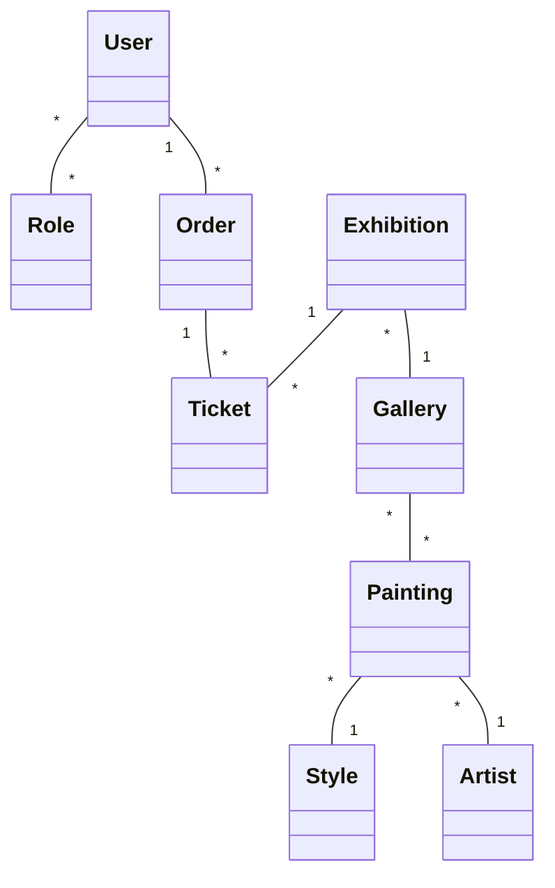
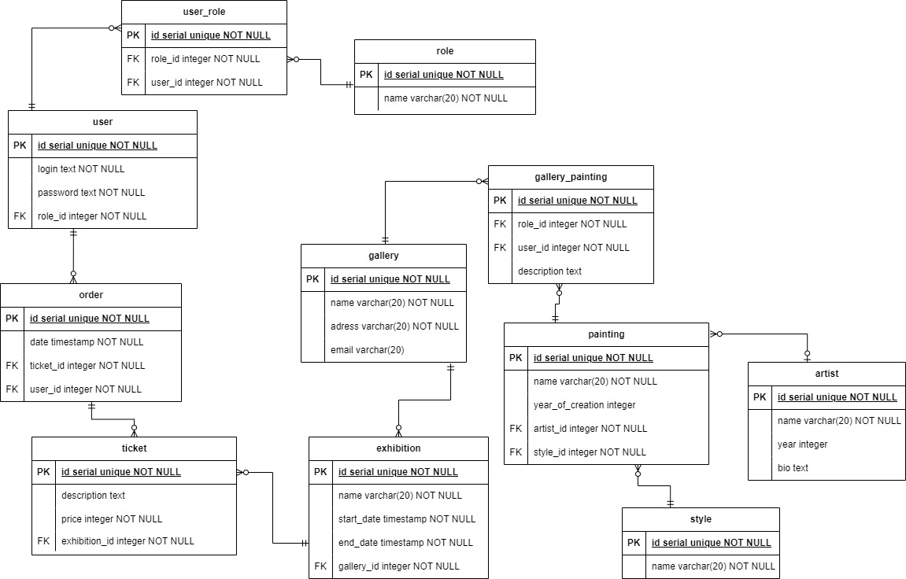

# highload-art-gallery

**Subject Area**: Art gallery management, exhibition ticket sales, and collection data storage.

There are many-to-many relationships between users and roles, as well as between galleries and paintings.

Database Schema:

